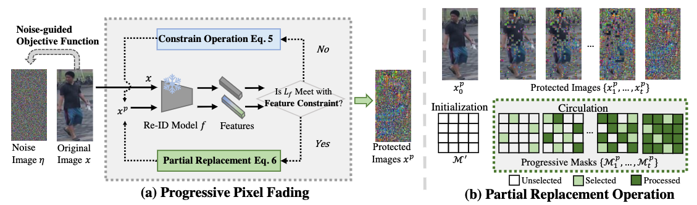
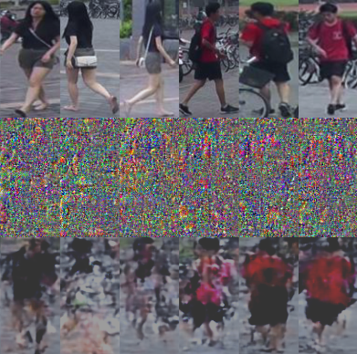
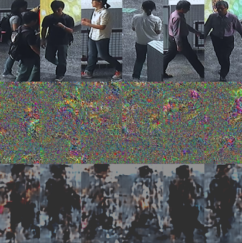

# <p align="center">PixelFade: Privacy-preserving Person Re-identification with Noise-guided Progressive Replacement</p>

### <p align="center">*Delong Zhang, Yi-Xing Peng, Xiao-ming Wu, Ancong Wu, Wei-shi Zheng*</p>

#### <p align="center">[[Paper]](https://openreview.net/pdf?id=TFueeF3aTo) </p>

Official repository of ACMMM 2024 paper "PixelFade: Privacy-preserving person re-identification with noise-guided progressive replacement".

  

## 💬 News
- [2024.07.30] Code of PixelFade is available. We also release Pre-trained Re-ID models.
- [2024.07.16] 🎊🥳🎉 Our work is accepted by ACMMM 2024!!! Thanks to co-workers and ISEE! Special thank to [Xiaoming Wu](https://dravenalg.github.io/)!!


## 🚀 **Key Features:**

1. **Noise-like Protection**: Converts pedestrian images into noise for visual protection.

2. **Resistance to Recovery Attack**: Achieves SOTA performance in resisting recovery attacks.

3. **Simple Integration**: If you have a pre-trained ReID model, you can directly use our algorithm to protect images.

4. **Scalability to Various ReID Scenarios**: Extends seamlessly to various ReID scenarios (such as infrared ReID and text-to-image ReID).


## 🏷️ Abstract

Online person re-identification services face privacy breaches from potential data leakage and recovery attacks, exposing cloud-stored images to malicious attackers and triggering public concern. 
The privacy protection of pedestrian images is crucial.
Previous privacy-preserving person re-identification methods are unable to resist recovery attacks and compromise accuracy.
In this paper, we propose an iterative method (**PixelFade**) to optimize pedestrian images into noise-like images to resist recovery attacks.
We first give an in-depth study of protected images from previous privacy methods, which reveal that the chaos of protected images can disrupt the learning of recovery models.
Accordingly, we propose Noise-guided Objective Function with the feature constraints of a specific authorization model, optimizing pedestrian images to **normal-distributed noise images** while preserving their original identity information as per the authorization model.
To solve the above non-convex optimization problem, we propose a heuristic optimization algorithm that alternately performs the Constraint Operation and the Partial Replacement operation.
This strategy not only safeguards that original pixels are replaced with noises to protect privacy, but also guides the images towards an improved optimization direction to effectively preserve discriminative features.
Extensive experiments demonstrate that our PixelFade outperforms previous methods in resisting recovery attacks and Re-ID performance.


## 👀 Visualization

 Market1501 visualization (From top to bottom, they are Original, Protected, Recovered)

  

 CUHK-03 visualization (From top to bottom, they are Original, Protected, Recovered)

  


## 🔧 Requirements

- Python = 3.9
- PyTorch == 1.12.0+cu116
- numpy
- pytorch-ignite=0.1.2
- yacs
- scipy=1.2.1
- piq

## Dataset preparation

Take Market1501 as example, download Market-1501 and modify the DATASETS.ROOT_DIR in configs/AGW_baseline_market1501.yml.

 - [Market1501](https://www.cv-foundation.org/openaccess/content_iccv_2015/papers/Zheng_Scalable_Person_Re-Identification_ICCV_2015_paper.pdf)

 - [CUHK03](https://www.cv-foundation.org/openaccess/content_cvpr_2014/papers/Li_DeepReID_Deep_Filter_2014_CVPR_paper.pdf)

 - [MSMT17](https://arxiv.org/pdf/1711.08565)


## 🌐 Download Pre-trained Models

You can download our pre-trained AGW Re-ID models from google drive:

- [Trained on Market-1501](https://drive.google.com/file/d/1cJ-LnGGpEckdUNElH8I6IsBibUV_ixup/view?usp=drive_link)

- [Trained on CUHK03](https://drive.google.com/file/d/1GMDPjm2019zFSibUicsF1AEkCQiIAmqq/view?usp=drive_link)

- [Trained on MSMT17](https://drive.google.com/file/d/1zZXwgJ8BuRMjqimY7mqli-tFlX9GgO6M/view?usp=drive_link)

## How to run?
You can refer to `run.sh` for running protection or recovery attack. Here we take Market1501 as an example.

-  🔐 Protect images of Re-ID dataset and get Re-ID metrics

```sh
python protect_image.py --config_file 'configs/AGW_baseline_market1501.yml'\
    --reid_ckpt_path 'ckpt/market1501_resnet50_nl_model_120.pth'\
    --output 'log/market1501_protect' --save_image_npy
```

- 👿 lauch recovery attack

```sh
python recovery_attack.py --npy_path 'log/market1501_protect' 
```


## Acknowledgement
We would like to thank the contributors to the [AGW](https://github.com/mangye16/ReID-Survey), [AVIH](https://github.com/suzhigangssz/AVIH), for their open research and exploration.


## 📝 Citation

If you find PixelFade useful for your research and applications, please cite using this BibTeX:

```bibtex
To be done
```


## 🕒 TODO List

- [x] PixelFade algorithm code
- [x] Model weights
- [x] Eval code (Re-ID, Recovery attack)
- [ ] Paper
- [ ] Inference code for any pre-trained Re-ID model


## 📨 Contact
If you have any questions, please feel free to contact with me at zhangdelong42@gmail.com.
